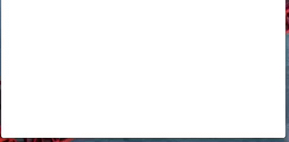

# SERFloatingAlertView

A simple component that can be used to present an info message/notice/warning to a user.

## Usage

Instanciate it, you might want to keep a strong reference around.

    SERFloatingAlertView *floatingAlertView = [[SERFloatingAlertView alloc] initWithText:message];

Customize it with an image.
    
    floatingAlertView.image = [UIImage imageNamed:@"notice.png"];

and a background image. Stretchable, of course.

    floatingAlertView.backgroundImage =
      [[UIImage imageNamed:@"background.png"]
        resizableImageWithCapInsets:UIEdgeInsetsMake(5, 4, 6, 4)];

Customize some more…

    floatingAlertView.label.font = [UIFont fontWithName:@"HelveticaNeue-Bold" size:13.0];

Tell it to show up. It will add itself as a subview and use a fancy animation to appear.

    [floatingAlertView presentInView:self.view];

That’s it. It will go away when it’s tapped, kind of fall down. You can drag it out down as well.

You can dismiss it manually like so.

    [floatingAlertView dismiss];

Wrap that in a block and `dispatch_after` if you want it to go away after a set time.

Also see the demo project and read the few lines of source, it’s not exactly rocket science. :)

## Attribution

This demo project includes an icon from [Glyphish](http://www.glyphish.com/ "Glyphish &ndash; Great icons for great iPhone &amp; iPad apps") by Joseph Wain.

* [AHEasing](https://github.com/warrenm/AHEasing)
* [UIView-EasingFunctions](https://github.com/zrxq/UIView-EasingFunctions)
* [SKBounceAnimation](https://github.com/khanlou/SKBounceAnimation)

This component was inspired by [ZAActivityBar](https://github.com/zacaltman/ZAActivityBar) among others.

## Notes

Compatibility: iOS 5.0

Link against the QuartzCore framework.

This component depends on 3 other libraries just to have nice animations (well, *I* think they’re nice). Ridiculous. I know.

See the LICENSE file.

(c) 2013 Stanley Rost

